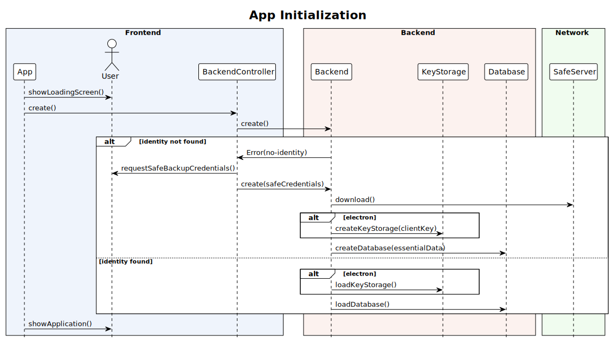
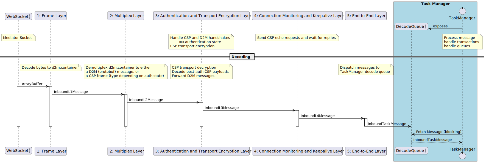
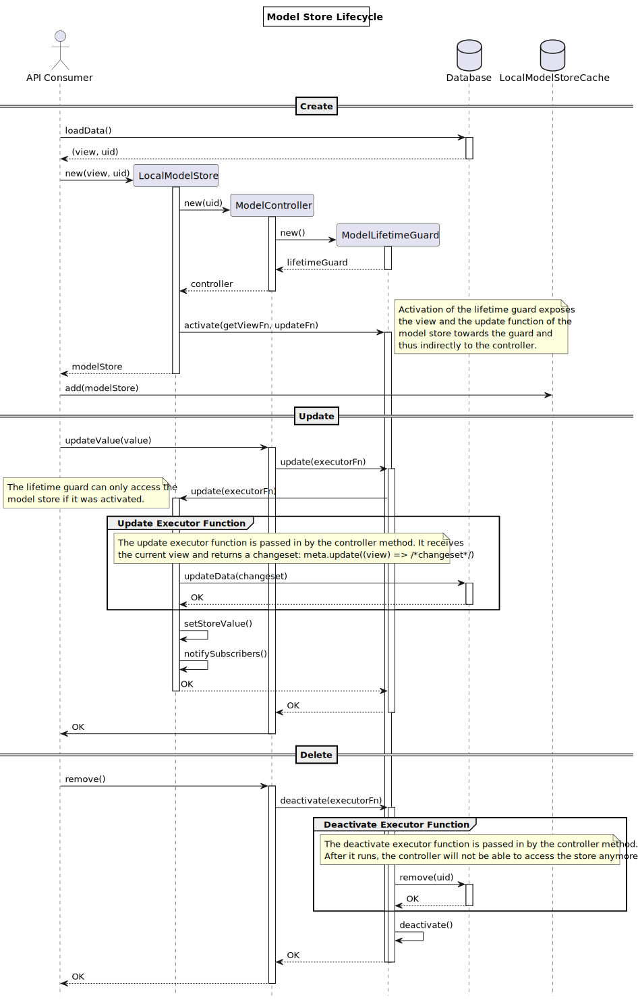

# Architecture

This file documents some aspects of the structure and architecture of the
Threema desktop project. It is by no means complete, but should help with
understanding and extending the codebase.

## Overview

Threema Desktop aims to support both a browser environment (`web`) and a
desktop application environment (`electron`). The feature set is very similar,
with a few important differences:

- In the web browser, no persistent storage is supported. This means that all
  data is kept only in-memory and will be gone after closing the browser
  window.
- Similarly, in the web browser, keys are volatile and will not be stored
  persistently. In contrast, the desktop application stores keys in an
  encrypted file (the `KeyStorage`).

In the [Electron process
model](https://www.electronjs.org/docs/latest/tutorial/process-model/), there
are three different process types:

- The `main` process. This is where a window is created and where the Electron
  application is initialized. This process has access to all NodeJS APIs, but
  not to the DOM. In Threema Desktop, the entry point is located at
  `src/electron/electron-main.ts`.
- The `preload` script. This script runs in the browser process, but – in
  contrast to the renderer process – can communicate with the main process.
- The `renderer` process. This process loads the target webapplication and has
  access to the DOM and the application's APIs. It does not have access to the
  NodeJS APIs. In Threema Desktop, the entry point is the `src/index.html`
  file. In development mode, a local development web server is used, while in
  release mode, the file is accessed directly through a `file://` URL.

The entry point of the web application itself is located at `src/app/app.ts`.
It loads all necessary services and also instantiates the backend worker.

The backend worker contains all the main business logic used in Threema
Desktop. It is the "core" of the application. Because the `web` and the
`electron` environments must be set up differently, there are two different
entry points:

- Electron: `src/worker/backend/electron/backend.worker.ts`
- Web: `src/worker/backend/web/backend.worker.ts`

The decision, which of these two backend workers is being loaded, is
implemented inside the Vite build system (inside the worker plugin).

## Directory Structure

All source code is in the `src` directory:

- `src/app` is the application that runs in the renderer process (for web, this
  is the entrypoint the browser will load). It allows access to the DOM and a
  subset of the Electron API (if compiled for Electron).
- `src/app/electron/main` is the entrypoint for Electron. It allows access to
  the Electron API.
- `src/common` is common code that can be imported by any of the other code
  bases.
- `src/common/dom` is common code that uses parts of the DOM API and can be
  imported by any other code base that provides the required subset of the
  DOM API. Note however that anything that can be done without the DOM should
  be in `src/common` instead.
- `src/common/node` is common code that uses the Node API and can be imported
  by any other code base that provides a Node environment. Note however that
  anything that can be done without the Node API should be in `src/common`
  instead.
- `src/worker/backend` is the entrypoint of the backend worker that will be
  started by the application. It does all the heavy lifting such as crypto,
  network connections and access to the database. It allows access to the
  WebWorker API (which is a subset of the DOM).
- `src/worker/backend/electron` and `src/worker/backend/web` are the entry
  points for the corresponding build variants. Code in these directories
  should be as short as possible (glue code).
- `src/worker/service` is the entrypoint of the service worker that will be
  started by the application. It allows access to the WebWorker API (which is
  a subset of the DOM with some additional properties).

Only source files matching `entry.*.ts` or `entry.ts` are valid entry points.
This ensures that no functions are being invoked implicitly when including
sources for unit testing since any `*.loader.ts` files will be excluded from
testing. These files should therefore be as minimal as possible (i.e. include
and call only).

## Model / Store / View Guidelines

All properties of inits and views should be `readonly`. If you need to make some property
temporarily mutable, e.g. when creating an init and needing to overwrite specific properties, use
`Mutable<SomeView, 'foo'>` for those specific properties. If this is too tedious because your code
changes a lot of properties before passing them down, use `Mutable<SomeView>`. Note that it is never
safe to cast `SomeView` retrieved from a model store to `Mutable<SomeView, ...>`.

⚠️ A note on `LocalModel` usage: For the time being, `LocalModel.view` is updated every time a
`LocalModelStore` is being updated. This can be surprising in async code when accessing `.view`.
Thus, it should be avoided to forward `LocalModel` instances to other functions. You should either
forward the `LocalModelStore` **or** the view snapshot of the `LocalModel`!

## Sequence Diagrams

This section shows sequence diagrams for a few core processes.

### App Initialization

Source files:

- App: `src/app/app.ts`
- BackendController: `src/common/dom/backend.ts`
- Backend: `src/common/dom/backend.ts`
- KeyStorage: `src/common/node/key-storage/index.ts`
- Database: `src/common/node/db/sqlite.ts` and `src/common/db/in-memory.ts`

### Protocol Layers

### Model Store Lifecycle

