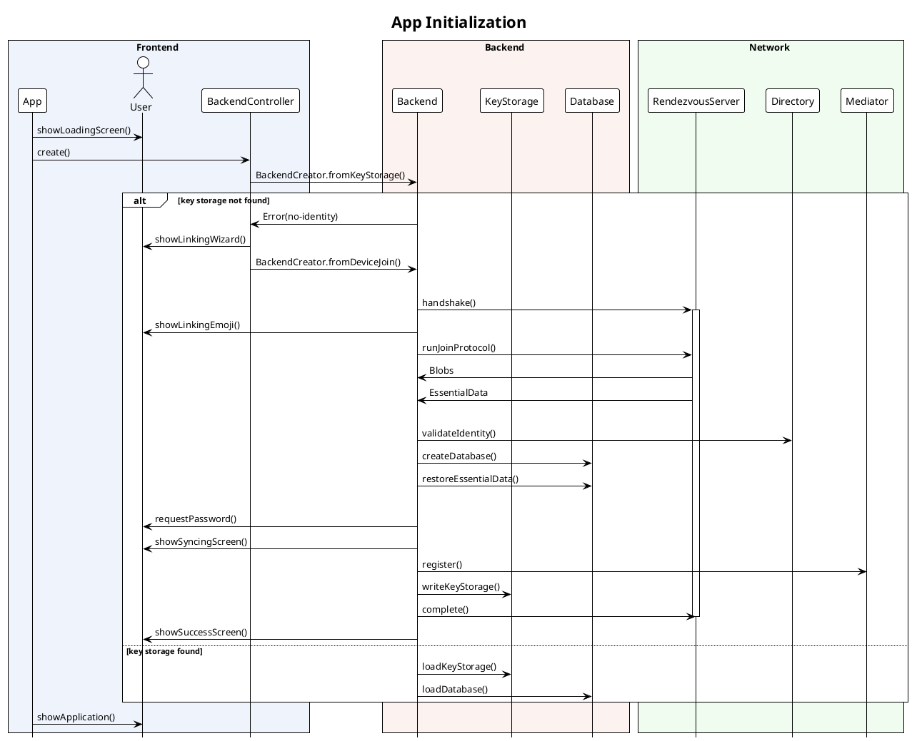
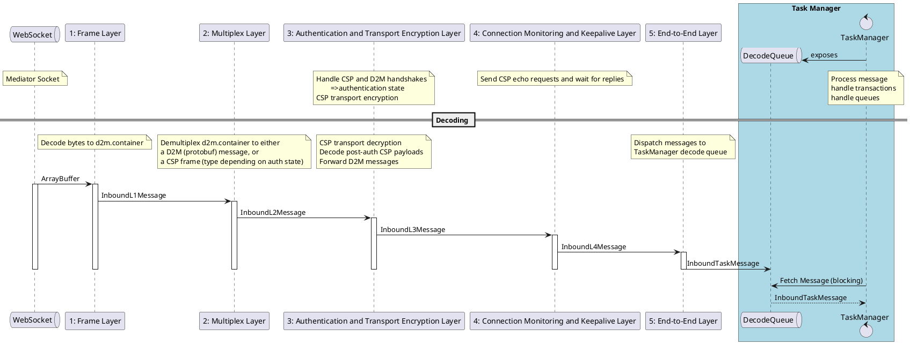
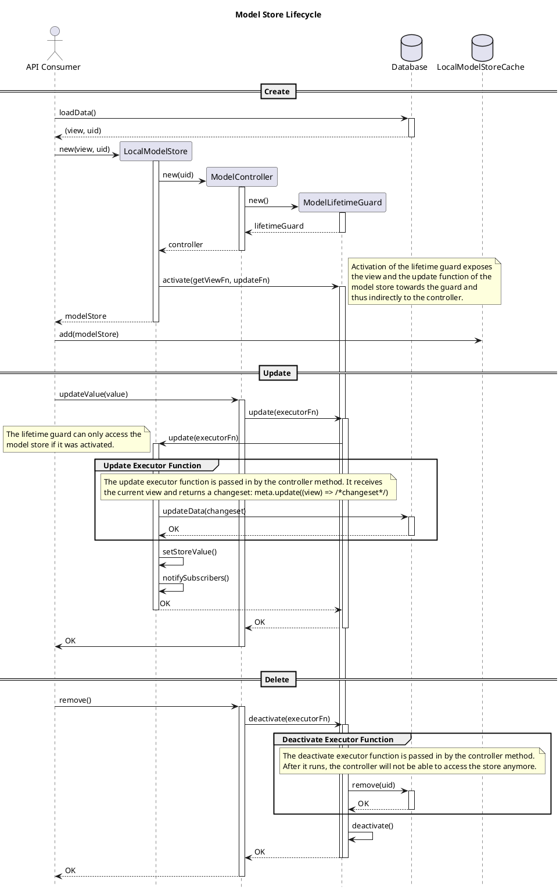

# Sequence Diagrams

This section shows sequence diagrams for a few core processes.

## App Initialization

Source files:

- App: `src/app/app.ts`
- BackendController: `src/common/dom/backend.ts`
- Backend: `src/common/dom/backend.ts`
- KeyStorage: `src/common/node/key-storage/index.ts`
- Database: `src/common/node/db/sqlite.ts` and `src/common/db/in-memory.ts`

## Protocol Layers

## Model Store Lifecycle

