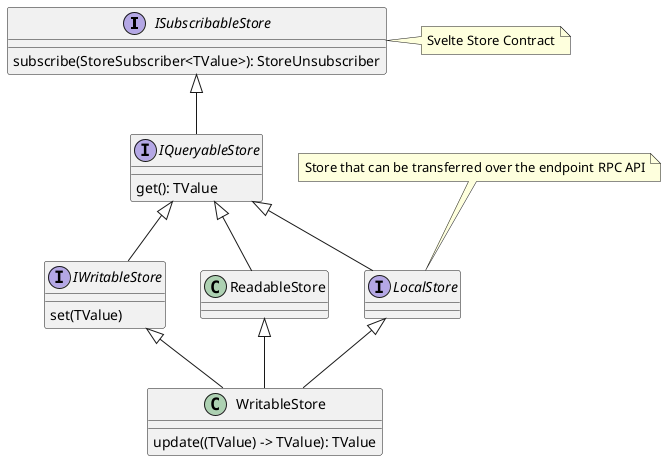

# Stores

We generally use our own implementation of Stores, which fullfil the contracts of
[Svelte Stores](https://svelte.dev/docs/svelte-store).

## General Store



## Special Stores

### `DerivedStore`

Derive a store's value using a derivation function, similar to the
[Svelte `derived`](https://svelte.dev/docs/svelte-store#derived) function.

Note that the derivation is lazy, i.e. is only executed if the store has subscribers.

#### Usage with `derive()` constructor

```ts
const messagesStore = new Store<Message[]>();

const unreadMessagesStore = derive([messagesStore], ([{currentValue: messages}]) => {
  return messages.filter((message) => message.isUnread);
});
```

It is possible to get the value and subscribe to additional stores which trigger a re-derivation:

```ts
const messagesStore = new Store<Message[]>();
const searchWordStore = new Store<string>();

const matchingMessagesStore = derive(
  [messagesStore],
  ([{currentValue: messages}], getAndSubscribe) => {
    const searchWord = getAndSubscribe(searchWordStore);
    return messages.filter((message) => message.text.includes(searchWord));
  },
);
```

### `SetStore`, `DerivedSetStore` and `SetBasedSetStore`

Set stores are optimized to hold a set of values (oftentimes other stores). They expose
`Store<Set<TValue>>` towards subscribers.

Set stores support delta updates: Changes triggered by `Set.add(value)`, `Set.delete(value)` and
`Set.clear()` are transferred as deltas, without re-serializing the entire set. The stores can also
be transferred over the endpoint [RPC API](./rpc.md).

#### `DerivedSetStore`

The `DerivedSetStore` executes a derivation function (similar to the `DerivedStore`) on every
element in the Set.

```ts
const messagesSetStore = new SetStore<Message>();

const messageIdsSetStore = new DerivedSetStore(messagesSetStore, (message) => {
  return message.messageId;
});
```

#### `SetBasedSetStore`

The `SetBasedSetStore` maps a plain, old, dumb `Store<Set<TValue>>` to an optimized
`SetStore<TValue>` with delta updates.

### `ModelStore<TModel, TView, TController, ...>`

Store that represents a data model. `ModelStore<TModel, TController>` exposes an object that
contains the model's `view` (i.e. the actual model data values) and a `controller`, which is used to
modify the data or get a reference to related `ModelStore`s.

#### `ModelStore`'s RPC Transfer Logic

`ModelStore`s have a special transfer logic that structurally clones the `view` data on every
update. The `controller` is exposed as a `Proxy` and has a `ModelLifetimeGuard` to prevent access to
deactivated models.
